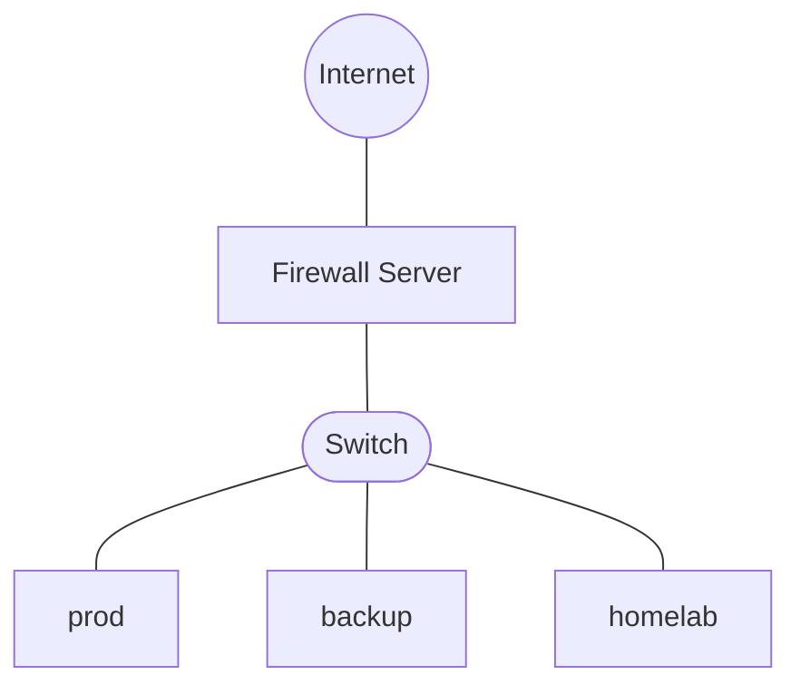

# Home Server Setup

This repository contains instructions and scripts for setting up the servers in my home network. The goal is to create a reliable and secure environment for hosting various services and applications.

## Servers

| Hostname | Description                                                     | Hardware                                                              | Operating System |
| -------- | --------------------------------------------------------------- | --------------------------------------------------------------------- | ---------------- |
| prod     | Production server hosting critical services                     | BeeLink EQ14, Intel N150, 16GB RAM, 500GB SSD system disk, 4 TB SSD   | Debian 13        |
| backup   | Backup server for the production server and client computers    | HP N54L, AMD Phenom II, 16GB RAM, 1x USB 64GB system disk, 4x 4TB HDD | Debian 13        |
| homelab  | Homelab server for testing and development                      | Lenovo ThinkCentre AMD Ryzen 5 PRO, 8 GB RAM, 240GB SSD               | Debian 13        |
| firewall | Firewall server providing network security and VPN connectivity | BeeLink EQ14, Intel N150, 16GB RAM, 500GB SSD system disk             | OPNsense 26.7     |

## Network Configuration

The servers are connected to a home network via gigabit Ethernet. The network is managed by the firewall server. The network is configured for IPv4 and IPv6 connectivity, with appropriate firewall rules to secure the servers and services.

## Domain Names

The servers are accessible via domain names configured in NextDNS that are not routable outside the local network. (They work over VPN if the DNS is routed through NextDNS with the appropriate NextDNS user ID set.) The following domain names are used for accessing the servers:

| Hostname | Domain Name               |
| -------- | ------------------------- |
| prod     | prod.lan.19781013.xyz     |
| backup   | backup.lan.19781013.xyz   |
| homelab  | homelab.lan.19781013.xyz  |
| firewall | firewall.lan.19781013.xyz |